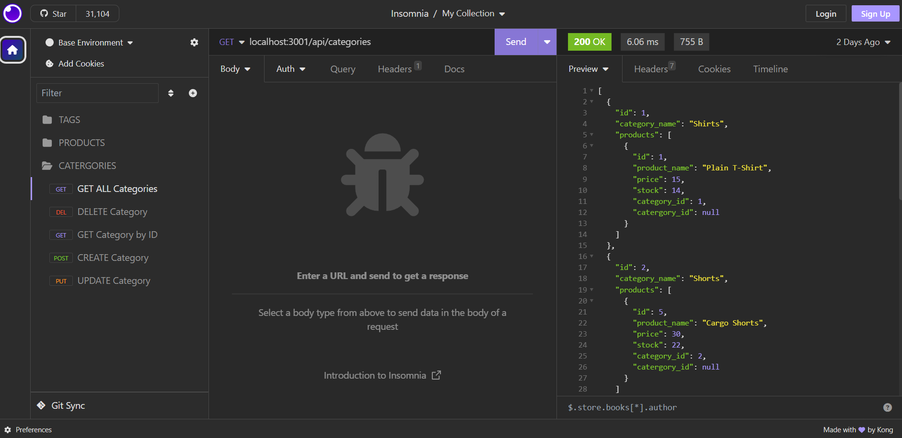

# ideal-internet-retail

## Description

This is the back end of an e-commerce website. It allows you to look up categories, products, and tags of items.

## Table of Contents

- [Technologies Used](#technologies-used)
- [Installation](#installation)
- [Usage](#usage)
- [Credits](#credits)
- [License](#license)

## Technologies Used

      

## Installation

- NodeJS
- MySQL

## Usage

In '.env.EXAMPLE' file, remove '.EXAMPLE' and add SQL user and password.
In the terminal:

- run 'npm install'
- run 'npm i sql'
- run 'npm i sequelize'
- run 'npm i express'
- run 'npm i dotenv'
- Then, run 'npm start'

It will say that it is listening at port 3001.

- Go to Insomnia

From there, you can access either Categories, Products, or Tags

Video Guide: https://watch.screencastify.com/v/52J81nulBug98WZKcGaV

## Credits

Starter code from fantastic-umbrella.

## License

MIT License
